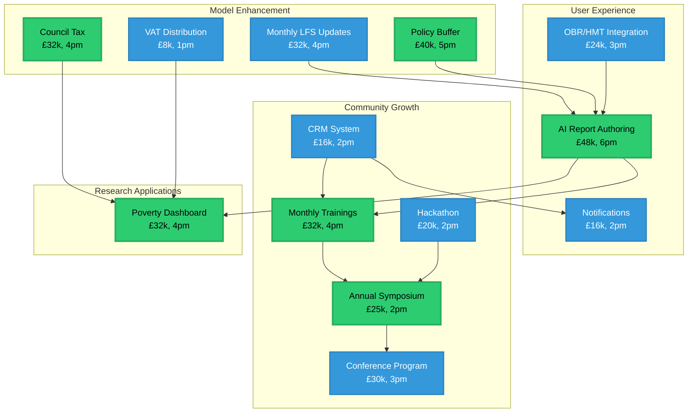

# Project Portfolio Component Relationships

## How to view this diagram

1. Copy the mermaid code above
2. Paste into [Mermaid Live Editor](https://mermaid.live)
3. Or view in any markdown renderer that supports Mermaid (GitHub, VS Code with extensions)
